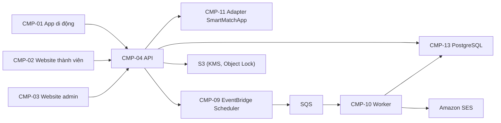

# DSN-1: Nền tảng chung và tài khoản

<!-- Skyline DESIGN: how the SPEC is built. Every rule of the parent SPEC gets an RZ row, every data field a DM row. Decisions list options; the owner chooses and the choice cites the owner's words (SRC). -->

## 1. Scope

Thiết kế nền tảng chung cho cả dự án (các app, backend, cơ sở dữ liệu, cloud, hàng đợi hẹn giờ, email, audit log, lưu trữ tệp bảo mật, repo và môi trường) và hiện thực SPEC-1 (tài khoản, onboarding, đăng nhập, đặt lại mật khẩu, sửa thông tin, xóa tài khoản). Các DSN sau (xác minh; hồ sơ, khám phá, kết nối cùng SmartMatchApp; thanh toán; an toàn và thông báo; admin) dùng lại các thành phần và quyết định ở đây (SRC-31#L19, SRC-31#L26).

## 2. Components

| Code | Component | Responsibility | Path |
| --- | --- | --- | --- |
| CMP-01 | App di động | App iOS và Android viết bằng React Native thuần: onboarding, đăng ký, đăng nhập, mọi màn thành viên; mở link email qua Universal Links (iOS) và App Links (Android) | apps/mobile |
| CMP-02 | Website thành viên | Next.js: đăng nhập, quên và đặt lại mật khẩu, sửa name và city, xóa tài khoản, quản lý gói; không có form đăng ký; phục vụ tệp apple-app-site-association và assetlinks.json | apps/web |
| CMP-03 | Website admin | Next.js, địa chỉ riêng; thiết kế ở DSN admin | apps/admin |
| CMP-04 | API | NestJS (TypeScript): REST API cho app, website và website admin, WebSocket cho nhắn tin; kiểm các rule của SPEC cho mọi thao tác từ client (app và website chỉ kiểm thêm để báo lỗi sớm; worker CMP-10 kiểm các rule chạy theo mốc thời gian) | apps/api |
| CMP-05 | Module xác thực | Đăng ký, xác nhận email, đăng nhập, khóa đăng nhập, phiên đăng nhập, quên và đặt lại mật khẩu | apps/api/src/auth |
| CMP-06 | Module tài khoản | Trạng thái tài khoản thực tế, sửa name và city, xóa tài khoản (thành viên và admin), hết hạn tài khoản | apps/api/src/account |
| CMP-07 | Module email | Hàng chờ gửi (outbox), giới hạn gửi theo địa chỉ và loại, gửi qua Amazon SES | apps/api/src/email |
| CMP-08 | Module audit | Ghi audit log chỉ-thêm trong cùng transaction với thay đổi; xuất hằng ngày ra S3 Object Lock | apps/api/src/audit |
| CMP-09 | Module hẹn giờ | Tạo và xóa một lịch EventBridge Scheduler cho mỗi mốc thời gian; lịch đẩy một thông điệp vào SQS khi tới mốc | apps/api/src/scheduler |
| CMP-10 | Worker | Tiến trình NestJS riêng đọc SQS: xử lý mốc tới hạn, gửi email từ outbox, xuất audit | apps/worker |
| CMP-11 | Adapter SmartMatchApp | Lớp duy nhất gọi API SmartMatchApp; phạm vi chờ spike, thiết kế ở DSN hồ sơ và kết nối | apps/api/src/smartmatch |
| CMP-12 | Gói kiểm tra dùng chung | Hàm chuẩn hóa và kiểm tra dùng chung cho app, website và API: NFC, bỏ ký tự trắng đầu cuối, chuẩn hóa email (SPEC-1/T-07), email hợp lệ (SPEC-1/T-09), tuổi (SPEC-1/T-04), danh sách quốc gia, mật khẩu | packages/shared |
| CMP-13 | Cơ sở dữ liệu | PostgreSQL trên Amazon RDS; schema và migration | apps/api/src/db |
| CMP-14 | Hạ tầng | Định nghĩa hạ tầng AWS dạng mã cho dev, staging, production | infra |

## 3. Data mapping

| Code | Spec field | Storage | Notes |
| --- | --- | --- | --- |
| DM-01 | SPEC-1/DF-01 | accounts.gender enum ('man', 'woman') NOT NULL | Trigger chặn mọi UPDATE cột này |
| DM-02 | SPEC-1/DF-02 | accounts.name text NULL | Lưu sau khi bỏ ký tự trắng đầu cuối và chuẩn hóa NFC; CHECK độ dài 1–100 code point; NULL sau khi xóa tài khoản (bản sao còn trong audit) |
| DM-03 | SPEC-1/DF-03 | accounts.email text NULL, accounts.email_normalized text NULL | Unique index một phần trên email_normalized WHERE status IN ('Unconfirmed', 'Active'); NULL sau khi xóa |
| DM-04 | SPEC-1/DF-04 | accounts.country text NULL | Mã ISO 3166-1 alpha-2, riêng District of Columbia lưu "US-DC" (ISO 3166-2) vì danh sách quốc gia có mục DC riêng; NULL sau khi xóa hoặc hết hạn |
| DM-05 | SPEC-1/DF-05 | accounts.city text NULL | Như name; NULL sau khi xóa hoặc hết hạn |
| DM-06 | SPEC-1/DF-06 | accounts.date_of_birth date NULL | NULL sau khi xóa hoặc hết hạn |
| DM-07 | SPEC-1/DF-07 | accounts.password_hash text NULL | Mã băm của mật khẩu đã chuẩn hóa NFC theo DEC-16; NULL sau khi xóa hoặc hết hạn |
| DM-08 | SPEC-1/DF-08 | accounts.status enum ('Unconfirmed', 'Active', 'Deleted', 'Expired') NOT NULL | Trạng thái được lưu; mọi chỗ đọc dùng trạng thái thực tế của RZ-16 |
| DM-09 | SPEC-1/DF-09 | accounts.created_at timestamptz NOT NULL DEFAULT now() | Thời điểm của PostgreSQL, UTC |
| DM-10 | SPEC-1/DF-10 | email_links(id, account_id, kind 'confirm' hoặc 'reset', token_hash, sent_at, used_at, superseded_at) | Token ngẫu nhiên 256 bit chỉ nằm trong link; bảng chỉ giữ SHA-256 của token; sent_at là thời điểm hệ thống nhận yêu cầu gửi email đó (RZ-13) |
| DM-11 | SPEC-1/DF-11 | accounts.failed_login_times timestamptz[] (tối đa 5 phần tử), accounts.locked_until timestamptz NULL | Giữ thời điểm của các lần sai liên tiếp gần nhất |
| DM-12 | SPEC-1/DF-12 | blocked_emails(email_hmac bytea PRIMARY KEY, created_at) | HMAC-SHA256 của email đã chuẩn hóa với một khóa bí mật tạo một lần cho mỗi môi trường, không bao giờ đổi, lưu trong AWS Secrets Manager có bản sao ở vùng thứ hai và bản sao lưu ngoại tuyến do khách giữ; không bao giờ xóa |

## 4. Interfaces

| Code | Operation | Input | Output | Errors | Covers |
| --- | --- | --- | --- | --- | --- |
| API-01 | POST /v1/auth/register | gender, name, email, country, city, dateOfBirth, password | 202, cùng một nội dung "Kiểm tra email để xác nhận" cho cả tạo mới lẫn trùng | 422 SPEC-1/R-01 (thiếu hoặc sai gender), 422 SPEC-1/R-02, 422 SPEC-1/R-03, 422 SPEC-1/R-04, 422 SPEC-1/R-06 | SPEC-1/R-01, SPEC-1/R-02, SPEC-1/R-03, SPEC-1/R-04, SPEC-1/R-05, SPEC-1/R-06, SPEC-1/R-11, SPEC-1/R-18, SPEC-1/P-01, SPEC-1/P-08 |
| API-02 | POST /v1/auth/confirm-email | token (gọi từ app khi link mở trong app, hoặc từ script của trang https://<website>/confirm khi link mở trên trình duyệt) | 200 kèm trạng thái "đã xác nhận" | 410 SPEC-1/R-05 (kể cả token không tồn tại hoặc không phải loại 'confirm') | SPEC-1/R-05, SPEC-1/X-01 |
| API-03 | POST /v1/auth/resend-confirmation | phiên đăng nhập của tài khoản Unconfirmed | 202 | 403 SPEC-1/R-16 (tài khoản không còn Unconfirmed), 429 SPEC-1/R-13 | SPEC-1/R-13, SPEC-1/R-16 |
| API-04 | POST /v1/auth/login | email, password, loại thiết bị | 200 kèm token phiên | 401 SPEC-1/R-15 (một thông báo chung cho mọi lý do) | SPEC-1/R-15, SPEC-1/R-16, SPEC-1/P-02 |
| API-05 | POST /v1/auth/password-reset/request | email | 202, cùng một nội dung cho mọi email | không có | SPEC-1/R-07, SPEC-1/R-13, SPEC-1/R-14 |
| API-06 | POST /v1/auth/password-reset/complete | token, newPassword | 200 | 410 SPEC-1/R-07 (kể cả token không tồn tại hoặc không phải loại 'reset'), 422 SPEC-1/R-06 | SPEC-1/R-07, SPEC-1/X-02, SPEC-1/P-03 |
| API-07 | POST /v1/auth/logout | phiên đăng nhập | 204 | không có | SPEC-1/R-15 |
| API-08 | GET /v1/me | phiên đăng nhập | 200 kèm thông tin và trạng thái thực tế; Unconfirmed chỉ có màn nhắc xác nhận | 401 | SPEC-1/R-10 |
| API-09 | PATCH /v1/me | name và/hoặc city | 200 | 422 SPEC-1/R-02, 403 SPEC-1/R-17 | SPEC-1/R-17, SPEC-1/P-05, SPEC-1/P-06, SPEC-1/P-07, SPEC-1/P-09, SPEC-1/P-10 |
| API-10 | POST /v1/me/delete | password | 204 | 401 SPEC-1/R-15, 403 SPEC-1/R-08, 409 SPEC-1/R-08 (gói chưa hủy) | SPEC-1/R-08, SPEC-1/X-04, SPEC-1/P-04 |
| API-11 | AccountService.adminDelete (gọi từ API admin, DSN admin) | accountId, adminId, tham chiếu, lý do | tài khoản Deleted | 409 SPEC-1/R-19 | SPEC-1/R-19, SPEC-1/X-05, SPEC-1/X-06 |
| API-12 | Thông điệp SQS "account.expire" | accountId | gọi expireAccount (RZ-16) | bỏ qua nếu tài khoản không tồn tại hoặc không còn Unconfirmed | SPEC-1/R-16, SPEC-1/X-03 |

## 5. Rule realization

| Code | Spec rule | Component | Enforcement |
| --- | --- | --- | --- |
| RZ-01 | SPEC-1/R-01 | CMP-01 | Cờ onboardingCompleted lưu trong bộ nhớ riêng của app (AsyncStorage) và bị loại khỏi sao lưu (Android: quy tắc loại trừ của Auto Backup; iOS: tệp đánh dấu không sao lưu); gỡ app, cài lại hay khôi phục sang máy mới đều làm cờ tắt; cờ bật khi thành viên tới màn chọn nhánh giới [CLARIFY: AA1 — "đi hết onboarding" là tới màn chọn nhánh giới hay đã chọn một nhánh]; khi cờ tắt, app luôn mở Welcome; nhánh giới chọn ở màn thứ 4 được gửi kèm API-01; khi cờ bật, màn đăng nhập có nút "Tạo tài khoản" mở thẳng màn chọn nhánh giới |
| RZ-02 | SPEC-1/R-02 | CMP-12, CMP-05 | Hàm validateRegistration trong CMP-12: gender phải là 'man' hoặc 'woman'; name và city bỏ ký tự trắng đầu cuối, chuẩn hóa NFC, đếm code point ≤ 100, chuỗi rỗng sau khi bỏ là thiếu; email chuẩn hóa rồi kiểm theo SPEC-1/T-09; app gọi để báo lỗi sớm (trừ tuổi, xem RZ-03), API gọi lại trước khi mở transaction; lỗi trả 422 với danh sách trường |
| RZ-03 | SPEC-1/R-03 | CMP-05 | Chỉ API kiểm tuổi: hàm ageOn(dateOfBirth, ngày UTC của đồng hồ PostgreSQL) đếm năm tròn, người sinh 29/2 thêm tuổi vào 1/3 năm không nhuận; tuổi < 18 thì 422 trước khi tạo tài khoản; app không kiểm tuổi trước vì không dùng đồng hồ của máy |
| RZ-04 | SPEC-1/R-04 | CMP-12, CMP-05 | Danh sách quốc gia có mục "District of Columbia" riêng (lưu "US-DC"); tập mã hợp lệ cho nam {US, US-DC, GU, PR, VI, MP, AS}, không có UM; cho nữ {PH}; API từ chối mã ngoài tập theo gender |
| RZ-05 | SPEC-1/R-05 | CMP-05, CMP-07, CMP-02, CMP-01 | Trong transaction tạo tài khoản: thêm email_links kind 'confirm' và một dòng outbox email; worker gửi sau khi commit; link có dạng https://<website>/confirm?token=…, mở trong app nếu app đã cài (Universal Links, App Links), ngược lại mở trang trên website; trang đó gọi API-02 bằng script khi tải xong, có nút "Mở trong app", và GET tới trang không đổi dữ liệu (trình quét link trong hộp thư không xác nhận được); API-02 tìm link theo SHA-256 của token và kind 'confirm' (không thấy thì 410), khóa dòng accounts (SELECT … FOR UPDATE), lấy thời điểm hiện tại bằng clock_timestamp() sau khi có khóa, rẽ nhánh theo trạng thái thực tế: Active trả "đã xác nhận"; Expired hoặc Deleted trả 410 và không đổi gì; Unconfirmed thì link hợp lệ khi used_at và superseded_at rỗng và số giây tròn từ sent_at tới hiện tại < 86 400, khi đó đặt status Active, đặt used_at và ghi audit, ngược lại 410 |
| RZ-06 | SPEC-1/R-06 | CMP-12, CMP-05 | Hàm validatePassword: chuẩn hóa NFC, 8–128 code point, có ít nhất một ký tự \p{L} và một chữ số 0–9, giữ nguyên dấu cách; băm theo DEC-16 từ chuỗi NFC; mọi lần so mật khẩu (đăng nhập API-04, xóa tài khoản API-10) đều chuẩn hóa NFC chuỗi nhập trước khi so |
| RZ-07 | SPEC-1/R-07 | CMP-05, CMP-07, CMP-02, CMP-01 | API-05 chỉ ghi yêu cầu (kèm thời điểm nhận) vào outbox và trả 202; worker tìm tài khoản theo email_normalized; nếu trạng thái thực tế là Unconfirmed hoặc Active và giới hạn RZ-13 cho phép, worker đánh dấu superseded_at cho link reset cũ, tạo link reset mới và gửi; link có dạng https://<website>/reset?token=…, mở trong app khi app đã cài (Universal Links, App Links) và mở trang đặt lại trên website khi chưa cài, trang có nút "Mở trong app"; API-06 tìm link theo SHA-256 của token và kind 'reset' (không thấy thì 410), khóa dòng accounts rồi dòng email_links, kiểm trạng thái thực tế (Expired hoặc Deleted thì 410) và hiệu lực link như RZ-05 (used_at, superseded_at rỗng, < 86 400 giây tròn), kiểm mật khẩu theo RZ-06, rồi trong một transaction: đặt used_at, đổi password_hash, xóa mọi phiên của tài khoản (đóng cả kết nối WebSocket của các phiên đó), xóa failed_login_times và locked_until, nếu Unconfirmed thì chuyển Active và ghi audit "xác nhận email", và ghi audit "đặt lại mật khẩu"; lần thứ hai dùng cùng token chờ khóa rồi thấy used_at và nhận 410 |
| RZ-08 | SPEC-1/R-08 | CMP-06 | API-10 khóa dòng accounts; đang khóa (locked_until > hiện tại) thì 401; so mật khẩu theo RZ-06 trước mọi kiểm tra khác: sai thì ghi một lần sai như RZ-15 và trả 401, đúng thì xóa failed_login_times; việc cập nhật số lần sai được commit trong transaction riêng trước khi trả lỗi; sau đó trạng thái thực tế khác Active thì 403, còn Subscription Active hoặc PastDue (module thanh toán) thì 409; ngược lại trong một transaction: status Deleted, xóa mọi phiên và đóng WebSocket của chúng, đặt NULL cho country, city, date_of_birth, password_hash, name, email, email_normalized, thêm HMAC vào blocked_emails, ghi audit (có name và email), xóa lịch hết hạn nếu có, và ghi sự kiện account.deleted vào outbox để worker yêu cầu các module khác (hồ sơ, ảnh, SmartMatchApp) xóa dữ liệu; không có bước chờ hoàn tác; mọi thao tác đổi Subscription của một nam (module thanh toán) phải khóa dòng accounts của nam trước; nhờ vậy việc bật lại gói và việc xóa tài khoản không chạy xen nhau |
| RZ-09 | SPEC-1/R-09 | CMP-08 | AuditService.append được gọi trong cùng transaction với tạo tài khoản và mọi thay đổi trạng thái của RZ-05, RZ-07, RZ-08, RZ-11, RZ-16, RZ-17, RZ-19; mỗi bản ghi có account_id, email, loại sự kiện, người thực hiện (thành viên, admin hoặc "hệ thống"), thời điểm; kích hoạt qua đặt lại mật khẩu ghi hai bản ghi (xác nhận email, đặt lại mật khẩu); bản ghi hết hạn lấy thời điểm created_at + 168 giờ và giữ email; đăng nhập không ghi |
| RZ-10 | SPEC-1/R-10 | CMP-04, CMP-01, CMP-02 | Guard mặc định trên mọi endpoint của thành viên: đọc phiên, tính trạng thái thực tế; Expired hoặc Deleted thì xóa phiên và trả 401; Unconfirmed chỉ được gọi API-03, API-07, API-08 và API-10, mọi endpoint khác (gồm xác minh) trả 403; app và website chỉ hiện màn nhắc xác nhận khi API-08 trả Unconfirmed |
| RZ-11 | SPEC-1/R-11 | CMP-05 | Transaction đăng ký lấy pg_advisory_xact_lock theo email_normalized; hai lần gửi cùng email chạy lần lượt; nếu HMAC có trong blocked_emails thì không tạo, không gửi; nếu có tài khoản Unconfirmed đã qua mốc 168 giờ thì gọi expireAccount (RZ-16) ngay trong transaction này, rồi tạo tài khoản mới; nếu có tài khoản trạng thái thực tế Unconfirmed hoặc Active thì không tạo và xếp email "bạn đã có tài khoản" qua RZ-13; unique index một phần của DM-03 là lớp chặn thứ hai; mọi nhánh trả cùng 202 |
| RZ-12 | SPEC-1/R-12 | CMP-13 | Không endpoint nào nhận gender ngoài API-01; trigger BEFORE UPDATE trên accounts báo lỗi khi gender đổi |
| RZ-13 | SPEC-1/R-13 | CMP-07, CMP-05 | Bảng email_send_log(email_hmac, kind, requested_at) ghi mỗi email được chấp nhận gửi, theo thời điểm hệ thống nhận yêu cầu; với kind 'confirm_resend', 'reset' hoặc 'already_registered', yêu cầu tại thời điểm t chỉ được chấp nhận khi lấy advisory lock theo (email_hmac, kind) rồi thấy 0 dòng có requested_at trong (t − 60 giây, t] và < 5 dòng trong ngày UTC của t; email xác nhận lúc đăng ký có kind 'confirm_initial' và không được đếm; API-03 kiểm ngay trong request và trả 429 khi vượt; API-05 và API-01 để worker kiểm theo thời điểm nhận đã lưu trong outbox, vượt thì không gửi và vẫn là 202; chỉ khi được chấp nhận mới đánh dấu superseded_at cho link cũ, và link mới có sent_at = t |
| RZ-14 | SPEC-1/R-14 | CMP-05 | API-05 không tra cứu tài khoản trong request mà chỉ ghi outbox và trả cùng một 202 với cùng nội dung cho mọi email |
| RZ-15 | SPEC-1/R-15 | CMP-05 | API-04 khóa dòng accounts theo email_normalized (chỉ tài khoản Unconfirmed hoặc Active còn email_normalized); email không có, trạng thái thực tế khác Unconfirmed và Active, locked_until > hiện tại hay sai mật khẩu đều trả cùng 401; lần thử khi đang khóa không được lưu; nếu locked_until ≤ hiện tại thì xóa failed_login_times và locked_until trước khi so; sai thì thêm thời điểm hiện tại vào failed_login_times (giữ 5 phần tử cuối), và khi đủ 5 phần tử mà phần tử cuối − phần tử đầu < 15 phút thì đặt locked_until = phần tử cuối + 15 phút; cập nhật này được commit trước khi trả 401; đúng thì xóa failed_login_times và tạo phiên theo DEC-17; thời điểm hiện tại là clock_timestamp() đọc sau khi có khóa |
| RZ-16 | SPEC-1/R-16 | CMP-06, CMP-09, CMP-10 | Hàm effectiveStatus(account, hiện tại) trả Expired khi status = 'Unconfirmed' và hiện tại ≥ created_at + 168 giờ, và được mọi rule dùng; thủ tục expireAccount khóa dòng, nếu còn Unconfirmed và đã qua mốc thì đặt Expired, ghi audit hết hạn (thời điểm created_at + 168 giờ, có email đọc trước khi xóa), đặt NULL cho name, email, email_normalized, country, city, date_of_birth, password_hash, xóa mọi phiên, xóa lịch hết hạn; khi tạo tài khoản, transaction ghi một dòng outbox "tạo lịch"; worker tạo một lịch EventBridge Scheduler một lần tại created_at + 168 giờ (thử lại tới khi thành công) đẩy "account.expire" vào SQS (API-12), và worker gọi expireAccount; khi tài khoản được xác nhận hoặc bị xóa, lịch bị xóa qua outbox; SPEC-1/N-01 (≤ 5 phút) đạt được vì lịch chạy đúng mốc và SQS chuyển gần như tức thì |
| RZ-17 | SPEC-1/R-17 | CMP-06 | API-09 chỉ nhận name và city (trường khác trả 403), yêu cầu trạng thái thực tế Active, chỉ kiểm các trường được gửi bằng quy tắc name, city của validateRegistration, và ghi audit sự kiện sửa name hoặc sửa city |
| RZ-18 | SPEC-1/R-18 | CMP-02, CMP-05 | Website không có route và không có form đăng ký; API-01 chỉ nhận yêu cầu có header định danh client là app di động; trình duyệt không gọi được qua giao diện (không phải hàng rào bảo mật, xem RISK-03) |
| RZ-19 | SPEC-1/R-19 | CMP-06 | AccountService.adminDelete từ chối khi admin không giữ vai trò Cấp cao nhất, hoặc tham chiếu hay lý do rỗng sau khi bỏ ký tự trắng; khóa dòng accounts (SELECT … FOR UPDATE); nếu trạng thái thực tế không phải Unconfirmed hay Active thì 409, và lần xóa thứ hai chạy sau khóa luôn thấy Deleted và bị từ chối; các bước xóa như RZ-08 nhưng không cần mật khẩu và không kiểm gói; trong cùng transaction gọi module thanh toán chuyển mọi Subscription còn hiệu lực sang Ended với người thực hiện là admin (SPEC-5/R-19); audit ghi người thực hiện là admin, kèm tham chiếu và lý do |

## 6. Decisions

| Code | Question | Options | Chosen | Source |
| --- | --- | --- | --- | --- |
| DEC-01 | Chia phần thiết kế thế nào? | 6 DSN duyệt lần lượt · một DSN cho cả 9 SPEC | 6 DSN, bắt đầu bằng DSN-1 cho nền tảng chung và SPEC-1 | SRC-31#L19, SRC-31#L26 |
| DEC-02 | App di động viết bằng gì? | Flutter · React Native (Expo) · React Native thuần | React Native thuần | SRC-30#L20, SRC-30#L36, SRC-31#L23, SRC-31#L29 |
| DEC-03 | Backend viết bằng gì? | TypeScript + NestJS · Python FastAPI · Go | TypeScript + NestJS | SRC-30#L21, SRC-30#L37 |
| DEC-04 | Website thành viên và website admin | Next.js, hai app, hai địa chỉ | Next.js, hai app riêng | SRC-30#L22, SRC-30#L38 |
| DEC-05 | Cơ sở dữ liệu | PostgreSQL · MySQL | PostgreSQL | SRC-30#L23, SRC-30#L39 |
| DEC-06 | Cloud | AWS · Google Cloud · Azure | AWS: RDS PostgreSQL, S3 mã hóa KMS, SES, ECS Fargate | SRC-30#L24, SRC-30#L40 |
| DEC-07 | Vai trò của SmartMatchApp | SmartMatchApp giữ dữ liệu gốc hồ sơ, like, tin nhắn · backend giữ dữ liệu gốc | SmartMatchApp giữ dữ liệu gốc hồ sơ, like, tin nhắn; API của mình đứng trước để kiểm rule rồi ghi sang; mọi chỗ dựa vào SmartMatchApp chờ spike, spike xong trước DSN hồ sơ và kết nối | SRC-30#L25, SRC-30#L41, SRC-31#L20, SRC-31#L26 |
| DEC-08 | Dịch vụ xác minh danh tính | Persona · Veriff · Onfido | Persona; CENOMAR do admin duyệt tay | SRC-30#L26, SRC-30#L42 |
| DEC-09 | Bộ xử lý thanh toán | Stripe Billing · bộ xử lý nhận ngành rủi ro cao (CCBill, Segpay) | Bộ xử lý nhận ngành rủi ro cao; chọn CCBill hay Segpay chưa chốt, chốt ở DSN thanh toán | SRC-30#L27, SRC-30#L43, SRC-31#L21, SRC-31#L27 |
| DEC-10 | Push và email | Firebase Cloud Messaging + Amazon SES | Firebase Cloud Messaging + Amazon SES | SRC-30#L28, SRC-30#L44 |
| DEC-11 | Nhắn tin thời gian thực | WebSocket trong backend · Ably hoặc Pusher | WebSocket trong backend, kèm push khi app đóng | SRC-30#L29, SRC-30#L45 |
| DEC-12 | Việc hẹn giờ | graphile-worker · Redis + BullMQ · AWS SQS; với SQS: quét mỗi phút · một lịch EventBridge cho mỗi mốc | AWS SQS, mỗi mốc một lịch EventBridge Scheduler riêng | SRC-30#L30, SRC-30#L46, SRC-31#L22, SRC-31#L28 |
| DEC-13 | Lưu giấy tờ xác minh | Bucket S3 riêng, riêng tư, KMS, link ký 5 phút cho admin Xác minh, ghi audit mỗi lần mở | Như lựa chọn đề xuất | SRC-30#L31, SRC-30#L47 |
| DEC-14 | Audit log | Bảng chỉ-thêm trong PostgreSQL + bản sao hằng ngày ra S3 Object Lock | Bảng chỉ-thêm (tài khoản ứng dụng không có quyền UPDATE hay DELETE trên bảng), bản sao hằng ngày ra S3 Object Lock; chế độ và thời gian khóa: [CLARIFY: AA4]; thời hạn lưu giữ chờ luật sư của khách | SRC-30#L32, SRC-30#L48 |
| DEC-15 | Repo và môi trường | Monorepo trong GitHub organization của khách; dev, staging, production | Như lựa chọn đề xuất | SRC-30#L33, SRC-30#L48 |
| DEC-16 | Thuật toán băm mật khẩu | Argon2id (tham số OWASP: 19 MiB, 2 vòng) · bcrypt (cost 12) | Argon2id, tham số OWASP (19 MiB, 2 vòng) | SRC-32#L19, SRC-32#L25 |
| DEC-17 | Phiên đăng nhập | Token phiên ngẫu nhiên lưu ở máy chủ, kiểm mỗi request · JWT sống 15 phút kèm refresh token | Token phiên ngẫu nhiên lưu ở máy chủ, kiểm mỗi request; đăng xuất mọi thiết bị bằng cách xóa mọi phiên của tài khoản | SRC-32#L20, SRC-32#L25 |
| DEC-18 | Công cụ định nghĩa hạ tầng | AWS CDK (Apache-2.0) · OpenTofu (MPL-2.0) · Terraform (BSL, không phải mã nguồn mở) | AWS CDK | SRC-32#L21, SRC-32#L25 |
| DEC-19 | Lớp truy vấn cơ sở dữ liệu | Drizzle (Apache-2.0) · Prisma (Apache-2.0) · Kysely (MIT) | Drizzle | SRC-32#L22, SRC-32#L25 |
| DEC-20 | Công cụ test | Jest + Playwright (web) + Detox (mobile) · Vitest + Playwright + Maestro | Jest (backend và app), Playwright (website), Detox (end-to-end app); tên test chứa mã AC | SRC-32#L23, SRC-32#L25 |

## 7. Implementation constraints

| Code | Constraint | Source |
| --- | --- | --- |
| IC-01 | Mã nguồn nằm trong GitHub organization của khách, khách có quyền admin suốt dự án | BRIEF-1/K-10 |
| IC-02 | Mọi tài khoản production (AWS, domain, Apple, Google Play, Firebase, Persona, bộ xử lý thanh toán, SmartMatchApp, Certn) thuộc khách | BRIEF-1/K-11 |
| IC-03 | Không dùng thư viện GPL, AGPL, SSPL hay copyleft tương tự khi chưa có phê duyệt bằng văn bản; bàn giao danh mục dependency và license | BRIEF-1/K-13, SRC-30#L33 |
| IC-04 | Mọi công nghệ dùng đều được công bố; không phụ thuộc ẩn | BRIEF-1/K-12 |
| IC-05 | Mọi thời điểm được lưu ở UTC | SRC-8#L58, SRC-8#L70 |
| IC-06 | Dữ liệu cá nhân được mã hóa khi lưu (RDS và S3 với KMS) và khi truyền (TLS) | BRIEF-1/K-08 |
| IC-07 | Thời hạn lưu giữ dữ liệu sau khi xóa tài khoản do khách và luật sư quyết định; tới khi có quyết định, không job nào xóa audit log | SRC-6#L31-L32, BRIEF-1/K-08 |
| IC-08 | Tên mỗi test chứa mã AC mà nó kiểm (ví dụ "SPEC-1/AC-05 …"), để skyline check --tests liên kết được | SRC-32#L23, SRC-32#L25 |

## 8. Risks

| Code | Risk | Impact | Mitigation |
| --- | --- | --- | --- |
| RISK-01 | SmartMatchApp giữ dữ liệu gốc (DEC-07) mà API chưa được spike | DSN hồ sơ và kết nối có thể phải đổi, hoặc phần thiếu phải chuyển về backend | Spike trước DSN hồ sơ và kết nối; mọi lời gọi đi qua CMP-11 |
| RISK-02 | Bộ xử lý thanh toán chưa chốt; CCBill hay Segpay có thể không làm được mọi yêu cầu của SPEC-5 | SPEC-5 phải sửa qua change flow | Chốt và spike trước DSN thanh toán |
| RISK-03 | SPEC-1/R-18 chỉ chặn ở giao diện; ai gọi thẳng API-01 bằng header của app vẫn đăng ký được | Có người đăng ký ngoài app | [CLARIFY: AA2 — chấp nhận trong MVP, hay thêm App Attest (iOS) và Play Integrity (Android) ngay] |
| RISK-04 | Mỗi mốc một lịch EventBridge (DEC-12) làm số lịch tăng theo số tài khoản, yêu cầu và gói | Chạm hạn mức lịch của tài khoản AWS | Xóa lịch khi mốc không còn cần; theo dõi hạn mức và xin tăng trước ra mắt |
| RISK-05 | Tài khoản SES mới ở chế độ sandbox; email xác nhận có thể vào thư rác | Thành viên không xác nhận được email | Xin quyền production cho SES, cấu hình SPF, DKIM, DMARC trước ra mắt |
| RISK-06 | React Native thuần (DEC-02) phải tự lo build và cập nhật phần native | Tốn công bảo trì hơn Expo | Dựng pipeline build iOS và Android sớm, ở milestone đầu |

## 9. Diagrams

## Change log

| Version | Date | By | Change |
| --- | --- | --- | --- |
